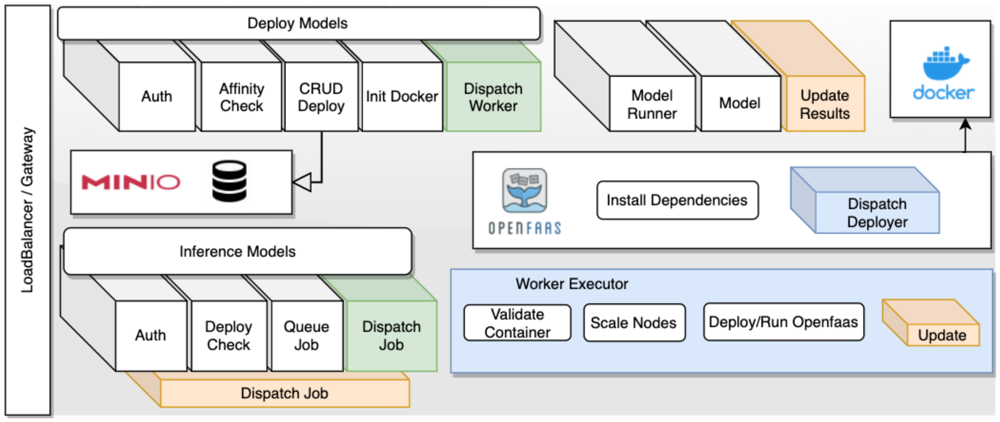

# Seamless Model Sharing for AI Practitioners

> The rapid advancements in AI and Machine Learning (ML) tech-nology, from both industry and academia lead to the need of large-scale, efficient and safe model sharing. With recent models, repro-ducibility has gained tremendous complexity both on executionand resource consumption level. Although sharing source-code andaccess to data is becoming common practice, the training processis limited by software dependencies, (sometimes large-scale) com-putation power, specialized hardware, and is time-sensitive. Nextto these limitations, trained models are gaining financial value andorganizations are reluctant to release models for public access. Allthese severely hinder the timely dissemination and the scientificsharing and reviewing process, limiting reproducibility. In this workwe make the case for transparent and seamless model sharing toenable the ease of reviewing and reproducibility for ML conferences.We design and implement a platform to enable practitioners to de-ploy trained models and create easy-to-use inference environments,which can be easily shared with peers, conference reviewers, and/ormade publicly available. Our solution follows a provider agnosticpractice and can be used internally in institutional infrastructuresor public/private cloud providers.

